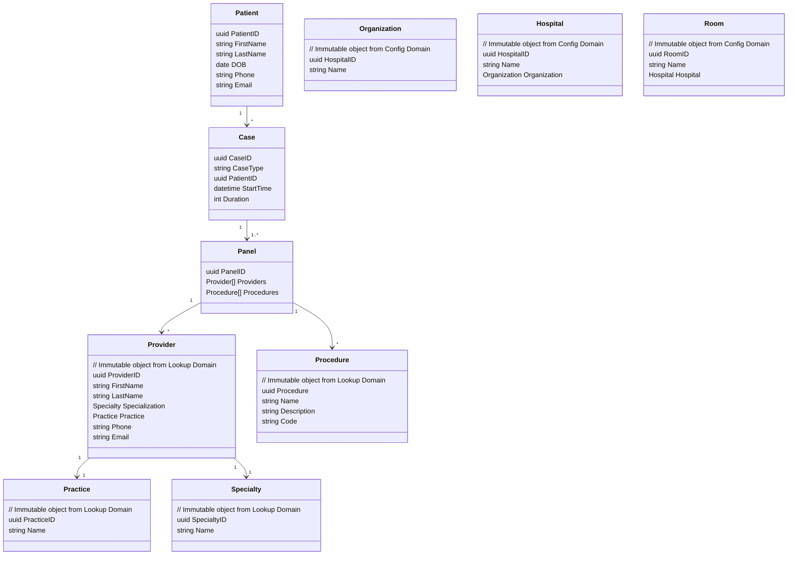

# NG-Example Healthcare Domain

## Overview:

The healthcare domain focuses on managing Cases, Patients, Providers, Procedures and their interactions. 

The data model reflects the key entities, value types, and relationships in the domain. It ensures that Patients, Cases, Providers, and Procedures are represented in a structured and organized manner, supporting data synchronization and maintaining data quality while allowing for a flexible and scalable system architecture.

The primary goal is to create a flexible and scalable system with a high level of data synchronization and quality while keeping the system loosely coupled from external Electronic Health Record (EHR) systems.

    Some detail is omitted in this model in order to focus on correct abstraction to support both surgical and non-surgical procedures:
    - Unnecessary/noisy details which detract from understanding the core model. These details can be added later for a complete model.
    - External EHR identities are described, but not implemented in the model.
    - Anesthesia is omitted in this model
    - Panels have a single Provider. Additional Providers and role details like primary/secondary are deferred.

## Data Model

### Entities:

- Patient:
    - Represents an individual Patient.
    - Contains attributes like Patient ID, name, DOB, phone and email.

- Provider:
    - Represents an individual Provider.
    - Contains attributes like Provider ID, name, specialization, phone and email.

- Case:
    - Represents a surgical Case involving one Patient.
    - Contains attributes like Case ID, Case type, and the associated Patient ID.

- Panel:
    - Represents a group of surgical Procedures performed in a single Case.
    - Contains attributes like Panel ID and the IDs of associated Providers and Procedures.

- Procedure:
    - Represents a single Procedure.
    - Contains attributes like Procedure ID, name, and description.

- Organization:
    - Represents an Organization that operates Hospitals
    - Contains attributes like Organization ID, name, and description.

- Hospital
    - Represents a single Hospital.
    - Contains attributes like Hospital ID, name, and description.

- Room
    - Represents a single location where Procedures are performed.
    - Contains attributes like  Room ID, name, and description.

- Practice
    - Represents a single medical Practice.
    - Contains attributes like  Practice ID, name, and description.

- Specialty
    - Represents a single medical specialization.
    - Contains attributes like Specialty ID, name, and description.

### Aggregate Root:

- Case (Aggregate Root):
    - Serves as the entry point for accessing and managing a Case and its related Panels.
    -  Contains business logic to maintain the consistency and integrity of the Case and its associated Panels.

### Relationships:

- A Patient is associated with one or more Cases.
- A Case contains one or more Panels, each representing a group of Procedures.
- A Panel includes a single Provider 
- A Panel includes one or more Procedures, expressing specific aspects of the surgery.

### Identity Management:

- Internal identity: UUIDs are used for internal identification of entities.
- External identity: A string field is used for external identification, managed by synchronization services. External identity is read-only within the domain model.

### External Domains

- Lookup Domain
    - Procedure
    - Specialty
    - Provider
    - Practice

- Config Domain
    - Organization
    - Hospital
    - Room

## Domain Model Diagram

