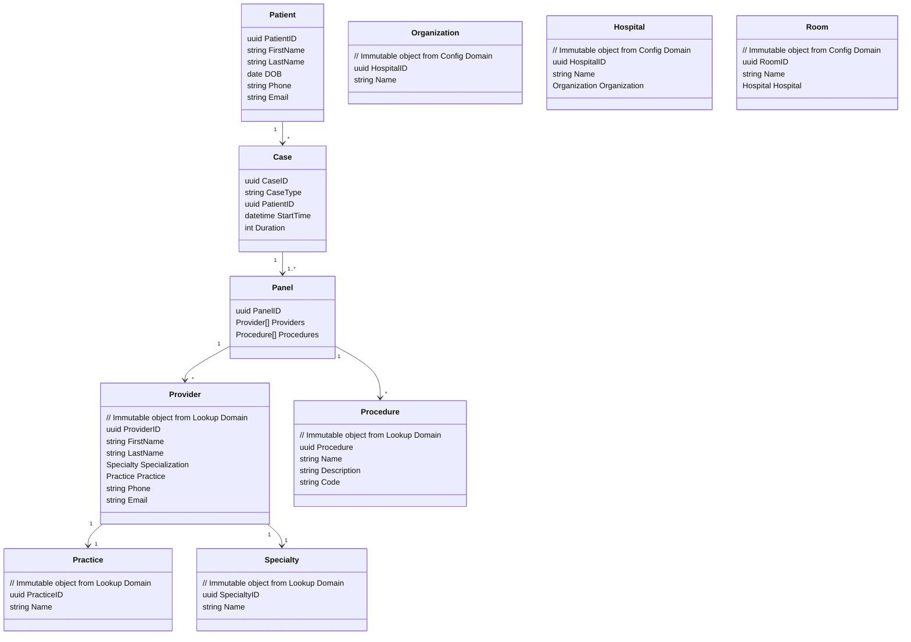

```mermaid
classDiagram

    Patient "1" --> "*" Case
    Case "1" --> "1..*" Panel
    Panel "1" --> "*" Provider
    Panel "1" --> "*" Procedure
    Provider "1" --> "1" Practice
    Provider "1" --> "1" Specialty

    class Patient {
        uuid PatientID
        string FirstName
        string LastName
        date DOB
        string Phone
        string Email
    }

    class Case {
        uuid CaseID
        string CaseType
        uuid PatientID
        datetime StartTime
        int Duration
    }

    class Panel {
        uuid PanelID
        Provider[] Providers
        Procedure[] Procedures
    }

    class Procedure {
        // Immutable object from Lookup Domain
        uuid Procedure
        string Name
        string Description
        string Code
    }

    class Provider {
        // Immutable object from Lookup Domain
        uuid ProviderID
        string FirstName
        string LastName
        Specialty Specialization
        Practice Practice
        string Phone
        string Email
    }

    class Practice {
        // Immutable object from Lookup Domain
        uuid PracticeID
        string Name
    }

    class Specialty {
        // Immutable object from Lookup Domain
        uuid SpecialtyID
        string Name
    }

   class Organization {
        // Immutable object from Config Domain
        uuid HospitalID
        string Name
    }

    class Hospital {
        // Immutable object from Config Domain
        uuid HospitalID
        string Name
        Organization Organization 
    }

    class Room {
        // Immutable object from Config Domain
        uuid RoomID
        string Name
        Hospital Hospital
    }

```